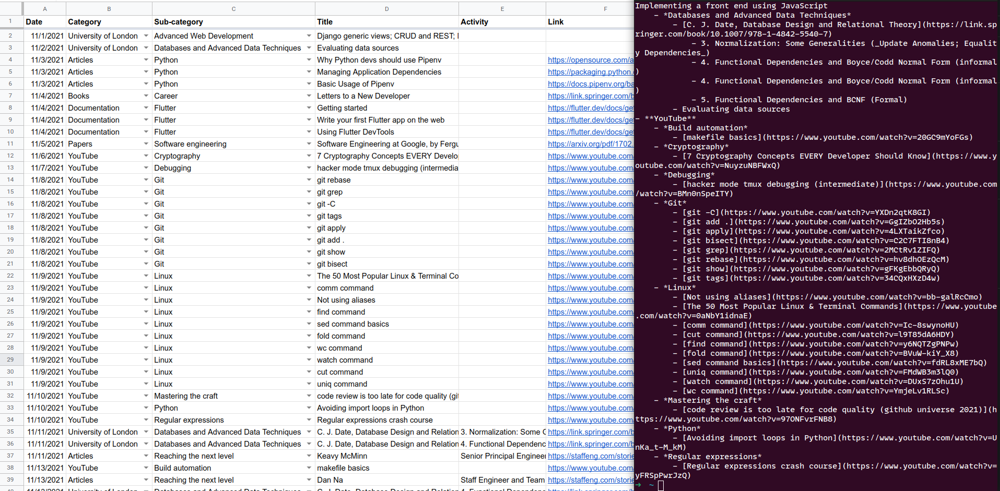
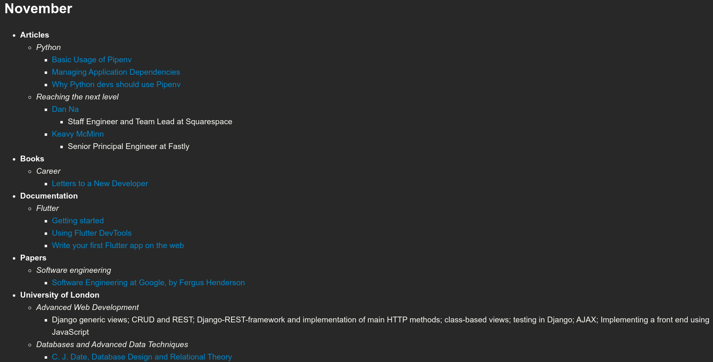

# learning-logs-to-markdown

The purpose of this tool is to parse and convert the content of a Google Sheets spreadsheet to Markdown. In this specific case, I just wanted a simple script to reduce the friction in getting a valid output I could use to maintain a ["learning log" on my website](https://www.sglavoie.com/learning-progress.html). So that gives me a quick way to input data in a spreadsheet and then I can take the time whenever needed to update the learning progress as desired by reformatting any of the entries and optionally adding notes to them.

## General software requirements

This tool should:

- Be able to read a private spreadsheet with a service account configured with the Google Sheets API.
- Convert rows from a Google Sheets spreadsheet into Markdown (see **Input** and **Output** sections below for details).
- Skip rendering rows that are missing a value for the `Title` or `Date` columns (it couldn't be rendered in the correct place properly without this information).
  - Other columns are optional and the corresponding level of nesting will be skipped if no value was provided (e.g. a category `Articles` may have an item with no sub-category and could be missing any of the other values except for `Title` and `Date`).
- Separate entries by month by parsing the `Date` column.
  - A command-line parameter should exist to specify a year from which the date should be extracted.
  - The output should be in reverse chronological order (i.e. for a full year with entries for each month, December will appear at the top and January at the bottom).
- Output a hierarchical format like the following: `Category > Sub-category > Title > Activity & notes`
- Group entries by category **and** sub-category (e.g. if a category is named `Articles` and there is a sub-category named `Python`, then `Python` must be nested under `Articles` for the corresponding month).
- Sort on the `Date` column before doing any parsing on other columns (rows in the spreadsheet _can_ be in non-chronological order).
  - Dates from a single year will be kept (either the year received as a parameter or the most recent year found).
- Sort `Category`, `Sub-category` and `Title` alphabetically (ascending order from top to bottom).
- **Not** sort the `Activity` column to preserve the order in which rows were added to the spreadsheet.
- Render links only if the `Link` column is a valid URL.
- **Not** validate the content of columns except for `Date` and `Link` (i.e. render the other columns as is).
- Display items with no category above those having a category. The same logic would be true for sub-categories.
- Format the output:
  - `Date` should become headers (`##`).
  - `Category` should be **bolded**.
  - `Sub-category` should be *emphasized*.
  - `Title` should become a [link](https://example.com) if the `Link` column contains a valid URL.
  - `Activity` should be nested under `Title`, occupying a new line for each activity.
  - `Notes` should appear (*italicized and inside parentheses*) next to the activity.
    - If there is a value for `Notes` but no value for `Activity`, the output would be next to the `Title`.

### Input

A spreadsheet with the following columns (starting with **Date**):

| [additional info]             | Date       | Category      | Sub-category         | Title                                  | Activity     | Link                                                                                 | Notes                    |
| ----------------------------- | ---------- | ------------- | -------------------- | -------------------------------------- | ------------ | ------------------------------------------------------------------------------------ | ------------------------ |
| November                      | 13/11/2021 | Articles      | Python               | Python slots, slots, and object layout |              | https://www.youtube.com/watch?v=Iwf17zsDAnY                                          | understood that X does Y |
| November                      | 14/11/2021 | Books         | Software engineering | The Pragmatic Programmer               | ch. 1        | https://pragprog.com/titles/tpp20/the-pragmatic-programmer-20th-anniversary-edition/ | note 1 here              |
| November                      | 15/11/2021 | Books         | Software engineering | The Pragmatic Programmer               | ch. 2        |                                                                                      | note 2 here too          |
| November                      | 16/11/2021 | Books         | Software engineering | Clean Code                             |              |                                                                                      |                          |
| December                      | 1/12/2021  | Documentation | Python               | The Python Tutorial                    | Sections 1-4 | https://docs.python.org/3/tutorial/index.html                                        |                          |
| December                      | 2/12/2021  | Books         | Software engineering | Clean Code                             | ch. 2-10     |                                                                                      |                          |
| Render available values       | 2/12/2021  | Books         |                      | Clean Coder                            |              |                                                                                      | book note                |
| Render available values       | 2/12/2021  |               |                      | Python/C API Reference Manual          |              | https://docs.python.org/3/c-api/index.html                                           |                          |
| Title missing: skip rendering | 3/12/2021  | Articles      |                      |                                        |              |                                                                                      |                          |
| Title missing: skip rendering | 3/12/2021  | Articles      | Software engineering |                                        | ch. 3        | https://docs.python.org/3/c-api/index.html                                           | note                     |
| Date missing: skip rendering  |            | Articles      | Python               | Python slots, slots, and object layout | Section 2    | https://www.youtube.com/watch?v=Iwf17zsDAnY                                          | note not rendered        |

### Output

A Markdown output to the terminal in the following format:

```markdown
## December

- [Python/C API Reference Manual](https://docs.python.org/3/c-api/index.html)
- **Books**
    - Clean Coder (_book note_)
    - *Software engineering*
        - Clean Code
            - ch. 2-10
- **Documentation**
    - *Python*
        - [The Python Tutorial](https://docs.python.org/3/tutorial/index.html)
            - Sections 1-4

## November

- **Articles**
    - *Python*
        - [Python slots, slots, and object layout](https://www.youtube.com/watch?v=Iwf17zsDAnY) (_understood that X does Y_)
- **Books**
    - *Software engineering*
        - Clean Code
        - [The Pragmatic Programmer](https://pragprog.com/titles/tpp20/the-pragmatic-programmer-20th-anniversary-edition/)
            - ch. 1 (_note 1 here_)
            - ch. 2 (_note 2 here too_)
```

## Installing this tool

*Tested only under Python 3.9.7*, requires at least Python 3.7+.

### Using `pip`

- [recommended] Activate a virtual environment.
- To install dependencies, run from this directory: `pip install -r requirements.txt`
- Then execute the script to run the tool: `python3 get_learning_logs`

### Using `pipenv`

- Run from this directory: `pipenv install`.
- Activate the newly created virtual environment with `pipenv shell`.
- Then execute the script to run the tool: `python3 get_learning_logs`

## How to use this tool

You will need to create an environment file (default path: `~/.learning-logs` or edit the path for `LEARNING_LOGS_ENV_PATH` in `get_learning_logs.py`). It should look as follows:

```env
SERVICE_ACCOUNT_FILEPATH="/path/to/service_account_learning_logs.json"
SPREADSHEET_ID=SPREADSHEET_ID  # Found in the URL of the document
WORKSHEET_ID=0  # First sheet is 0 by default, it comes after the URL parameter `gid`
```

To set up this project, you will have to:

- Enable the Google Sheets API for your project (https://support.google.com/googleapi/answer/6158841?hl=en).
- In the project, search for "service account" in the search bar and create new credentials.
- Download the credentials and put them at the path `SERVICE_ACCOUNT_FILEPATH` referenced in the environment file.
- Create a spreadsheet with the following columns (not necessarily in that order): `Date`, `Category`, `Sub-category`, `Title`, `Activity`, `Link`, `Notes`.
  - The column `Date` Should match a date format: select all cells from that column, go to `Format > Number > Date` to apply the expected format (`mm/dd/yyyy`). You can then input a date (e.g. `11/1/2021`) and you will see a calendar pop up when double-clicking on it. Dragging it down to a new cell will create a new date for the next day (in this example, `11/2/2021`).
- Get its `SPREADSHEET_ID` (`https://docs.google.com/spreadsheets/d/SPREADSHEET_ID_HERE/edit#gid=0`) to put it in the environment file.
- Get the `WORKSHEET_ID` (the integer after `gid=` in the URL of the document).
- From the spreadsheet document (or from the folder view in Google Drive), share with the email associated with the service account (e.g. `learning-logs-something@project-name-12345.iam.gserviceaccount.com`). Read access ("Viewer" permission) is enough.

By now, the script is ready to be called. I just created an alias to execute it more easily by putting the following in `~/.bash_aliases` (you will have to adapt the paths of course):

```sh
alias learning-logs='~/.local/share/virtualenvs/learning-logs-to-markdown-XJLvhmzn/bin/python3.9 \
  ~/dev/sglavoie/dev-helpers/learning-logs-to-markdown/get_learning_logs.py'
```

This will output the converted data from the spreadsheet to Markdown [as shown above](#output).

## Example usage and output (sample)

### Input (spreadsheet) and output (raw Markdown)



### Formatted Markdown output


