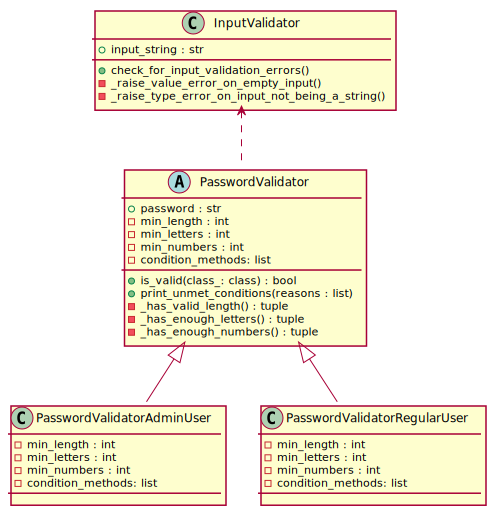

# Class diagram



Using [PlantUML](https://plantuml.com), the following code can be used to produce the above diagram:

```uml
@startuml
class InputValidator
abstract class PasswordValidator
class PasswordValidatorAdminUser
class PasswordValidatorRegularUser

InputValidator <.. PasswordValidator
PasswordValidator <|-- PasswordValidatorAdminUser
PasswordValidator <|-- PasswordValidatorRegularUser

class InputValidator {
   +input_string : str
   +check_for_input_validation_errors()
   -_raise_value_error_on_empty_input()
   -_raise_type_error_on_input_not_being_a_string()
}

abstract class PasswordValidator {
   +password : str
   - {abstract} min_length : int
   - {abstract} min_letters : int
   - {abstract} min_numbers : int
   - {abstract} condition_methods: list
   + {static} is_valid(class_: class) : bool
   + {static} print_unmet_conditions(reasons : list)
   -_has_valid_length() : tuple
   -_has_enough_letters() : tuple
   -_has_enough_numbers() : tuple
}

class PasswordValidatorAdminUser {
   -min_length : int
   -min_letters : int
   -min_numbers : int
   -condition_methods: list
}

class PasswordValidatorRegularUser {
   -min_length : int
   -min_letters : int
   -min_numbers : int
   -condition_methods: list
}
@enduml
```
