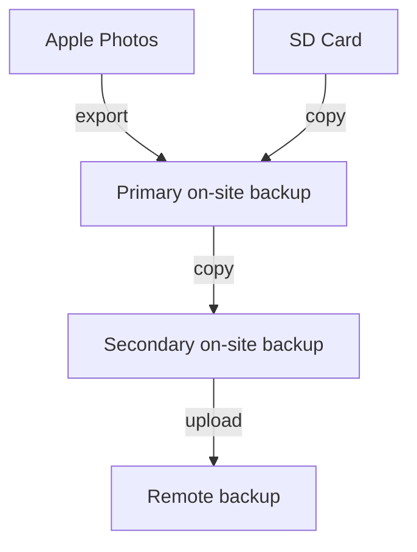

# osxphotos

Opinionated backup solution for Apple Photos on macOS.

## Goals

1. Back up all photos and videos from Apple Photos to an external drive.
2. Preserve metadata (EXIF, IPTC, etc.) as much as possible.
3. Back up RAW files from SD card to external drive.
4. Back up all of the above to a local directory.
5. Back up all of the above to a cloud storage provider.
6. Do so with incremental backups.



## Development

### Using Rye

```bash
rye sync
```

### Using built-in Python

```bash
python3 -m venv .venv
source .venv/bin/activate
pip install -e .

# Use from elsewhere:
# `which python`
/path/to/.venv/bin/python -m osxphotos.cli.cli
```
