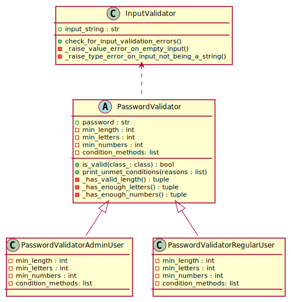
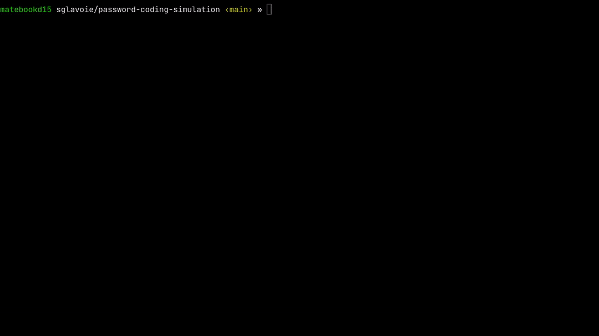

# Password Validator

### Table of contents

- [Introduction](#introduction)
  - [Regular (Normal) users](#regular-normal-users)
  - [Admin users](#admin-users)
- [Requirements](#requirements)
- [Executing this tool](#executing-this-tool)
- [Running the test suite](#running-the-test-suite)
  - [Sample output](#sample-output)
- [Inner workings](#inner-workings)
  - [Class diagram](#class-diagram)
  - [Design decisions](#design-decisions)
  - [Assumptions made](#assumptions-made)
- [Live demo](#live-demo)

---

## Introduction

This tool will verify the strength of a password and output a message confirming whether a given password meets the following requirements or not.

### Regular (Normal) users

- The password must be **at least 10 characters** in length;
- The password must contain **at least 1 letter**;
- The password must contain **at least 1 number**.

### Admin users

- The password must be **at least 13 characters** in length;
- The password must contain **at least 1 letter**;
- The password must contain **at least 1 number**;
- The password must contain **at least 3 special characters**.

## Requirements

- Python 3.6+ is required.

Please make sure that you are running Python 3.6+ by typing the following command in a terminal:

```bash
python --version
```

Note: If the output indicates that Python 2 is being used, you may need to substitute `python` for `python3`.

For more information on how to set up Python 3 on your system, please refer to the following documentation:

- Using [Macintosh](https://docs.python.org/3/using/mac.html);
- Using [Unix/Linux](https://docs.python.org/3/using/unix.html);
- Using [Windows](https://docs.python.org/3/using/windows.html).

External libraries are required to run the test suite. To install the necessary dependencies, please run the following command from this directory inside a virtual environment:

```bash
pip install -r requirements.txt
```

For more on how to set up a virtual environment, please visit [this page of the official documentation at python.org](https://docs.python.org/3/tutorial/venv.html).

## Executing this tool

To run the tool, type the following command from the root directory of this project (substituting `python` with `python3` if necessary):

```bash
python -m pcs
```

This will run the local module `pcs` (short for _Password Coding Simulation_), display a prompt for you to select a type of user (either "Admin" or "Regular") and then a second prompt to enter a password to validate its strength.

## Running the test suite

To run the test suite using the default configuration, type the following command in a terminal:

```bash
pytest
```

You will see as output (sample shown in the section below) the list of files from which tests are being run as well as some statistics on the code coverage.

### Sample output

```bash
$ pytest
======================================================================= test session starts ========================================================================
platform linux -- Python 3.8.5, pytest-6.2.3, py-1.10.0, pluggy-0.13.1
rootdir: /home/sglavoie/dev/sglavoie/password-coding-simulation, configfile: pytest.ini, testpaths: tests
plugins: cov-2.11.1
collected 39 items                                                                                                                                                 

tests/test_input_validator.py ............                                                                                                                   [ 30%]
tests/test_password_validator.py ...........................                                                                                                 [100%]

----------- coverage: platform linux, python 3.8.5-final-0 -----------
Name    Stmts   Miss  Cover   Missing
-------------------------------------
-------------------------------------
TOTAL      33      0   100%

3 files skipped due to complete coverage.

Required test coverage of 100% reached. Total coverage: 100.00%

======================================================================== 39 passed in 0.15s ========================================================================
```

## Inner workings

### Class diagram

The simple software architecture of this tool is shown in the diagram below:



### Design decisions

- This code assumes that a string is to be validated as a password since it can contain any character (hence, it is not restricted to a particular type of content such as an integer), therefore the `PasswordValidator` class is constructed from a string.
- An `InputValidator` class has been created, on which the `PasswordValidator` depends to receive its input, to allow for easy extensibility of the program should it need to support passing arguments and/or options at a later point. Furthermore, the `InputValidator` class will prove useful to test against edge cases, such as receiving an empty string – which shall not be considered a valid password.
- Each validation in `PasswordValidator` returns a tuple to indicate whether the condition was met or not as well as to provide an explanation when the condition isn't met. This is done for efficiency purposes so that conditions can be evaluated only once to provide all the necessary information in one go.
- A subclass for each user has been created so that the common features/validations of the `PasswordValidator` abstract class can be inherited by its child classes without a need to re-implement them for each type of user. In this way, it will be easy to add new types of users, each having their own set of requirements.

### Assumptions made

- It is assumed that a _"letter"_ is defined as any letter from the [Modern English alphabet](https://en.wikipedia.org/wiki/English_alphabet) consisting of _"26 letters with no diacritics, diagraphs, and special characters"_.
- A _"number"_ in the context of a password is herein assumed to refer to a [_"numerical digit"_](https://en.wikipedia.org/wiki/Numerical_digit) (Arabic numeral). Hence, a _"number"_ is defined as any of the following digits: `0 1 2 3 4 5 6 7 8 9`.
- The tool assumes that a password cannot be empty. Even if all the password requirements were to be removed, an empty password is not to be accepted as a valid password by this tool.
- It is also assumed that the tool should deal with reading the input from the user as simply as possible. For this reason, a prompt is displayed to the user upon executing the program.
- It is assumed that an "Admin" user must obey the same password restrictions as a "Regular" user on top of additional restrictions specific to this user type. In other words, the tool assumes that a minimum number of letters and numbers must also be met for an Admin since the password of the Admin user must be stronger than that of the Regular user.

## Live demo

In this demo, it is shown how to install the necessary development requirements inside a virtual environment. Then, it can be seen how the program is executed for different types of users, in both cases trying valid and invalid passwords according to the password strength requirements. Finally, the demo ends by showing the execution of the test framework, `pytest`.


