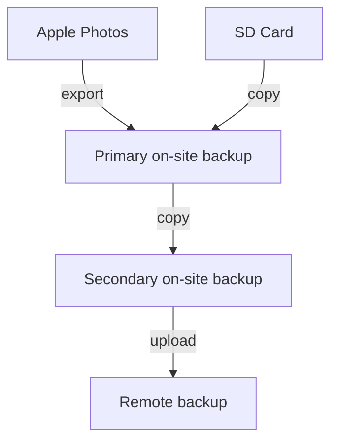

# osxphotos

Opinionated backup solution for Apple Photos on macOS.

## Goals

1. Back up all photos and videos from Apple Photos to an external drive.
2. Preserve metadata (EXIF, IPTC, etc.) as much as possible.
3. Back up RAW files from SD card to external drive.
4. Back up all of the above to a local directory.
5. Back up all of the above to a cloud storage provider.
6. Do so with incremental backups.



## Commands

| Command | Description |
|---------|-------------|
| `cli apple-photos` | Export from Apple Photos to primary backup |
| `cli sd-card` | Copy RAW files from SD card to primary backup |
| `cli ssd` | Sync primary backup to secondary on-site backup (SSD) |
| `cli remote` | Sync backup to cloud via rclone |
| `cli backup-all` | Run the full pipeline (all of the above) |

## Finding late shared photos

Apple Photos exports are organized by the photo's content creation date, so a
photo taken in March or April can appear in an older month directory even when
it is first synchronized in June. The Apple Photos export command writes an
additional `late_photo_additions_YYYY-MM-DD.csv` report next to the
`photos_export_YYYY-MM-DD.csv` report. It lists files that were `new` or
`updated` during the run, their Spotlight/Finder dates, device make/model, and
whether the file matches configured spouse-device models.

Configure spouse-device models in `~/.osxphotos.env`:

```sh
APPLE_PHOTOS_SPOUSE_DEVICE_MODELS="iPhone SE (2nd generation),iPhone 17"
```

For an immediate Finder-compatible search, use Spotlight metadata directly:

```sh
mdfind -onlyin /Users/sglavoie/Pictures/export \
'kMDItemDateAdded >= $time.iso(2026-06-01T00:00:00Z) &&
 kMDItemContentCreationDate < $time.iso(2026-06-01T00:00:00Z) &&
 kMDItemAcquisitionModel == "*iPhone SE*"'
```

The same fields can be used in a Finder Smart Folder scoped to the export
directory: `Date Added`, `Content created`, and, when Finder exposes it,
`Device model`. Use the generated CSV when Finder cannot show `Device model` as
a list column.

## Remote backup (rclone)

The `remote` command syncs your backup to a cloud storage provider using
[rclone](https://rclone.org/).

1. Install rclone: `brew install rclone` or see https://rclone.org/install/
2. Configure a remote: `rclone config`
3. Set `RCLONE_REMOTE` in `~/.osxphotos.env` (e.g. `b2:my-photos-bucket`)
4. Optionally set `RCLONE_SRC_PATH` (defaults to `SSD_DST_PATH`)

## Development

### Using uv

```bash
uv venv
uv pip install -e .
uv run cli apple-photos --use-photokit --download-missing
```

### Using built-in Python

```bash
python3 -m venv .venv
source .venv/bin/activate
pip install -e .

# Use from elsewhere:
# `which python`
/path/to/.venv/bin/python -m osxphotos.cli.cli
```
