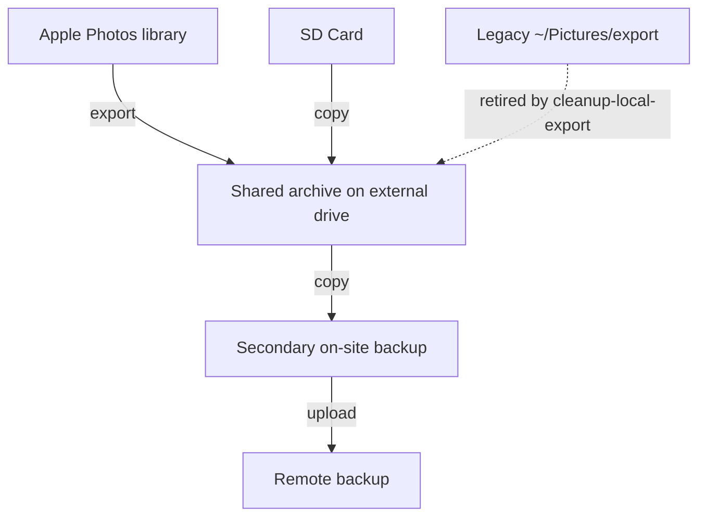

# photos-backup

Opinionated backup solution for Apple Photos on macOS.

## Goals

1. Keep one shared archive of every photo and video in Apple Photos on an
   external drive, writable from more than one Mac.
2. Preserve metadata (EXIF, IPTC, album names) as much as possible.
3. Mirror deletions from the library into the archive, but never without proof.
4. Back up RAW files from an SD card to the same drive.
5. Copy the result to a second on-site drive and to cloud storage.
6. Do all of it incrementally, and stop rather than guess.


```mermaid
flowchart TD
    A[Apple Photos library] --export--> B[Shared archive on external drive]
    E[SD Card] --copy--> B
    B --copy--> C[Secondary on-site backup]
    C --upload--> D[Remote backup]
    F[Legacy ~/Pictures/export] -.retired by cleanup-local-export.-> B
```

The archive is the only authoritative copy. It carries its own osxphotos export
database and run state under `.photos-backup/`, so any Mac that mounts the drive
can continue the same history instead of starting a private one.

## Installation

```bash
cd python/photos_backup
uv sync
uv tool install --editable .   # or: uv pip install -e .
photos-backup --help
```

`photos-backup` is the entry point; `cli` remains as an alias for it and exposes
the same commands. Configuration is not installed by this repository: it is
stow-managed at `~/.config/osxphotos-backup/photos-backup.toml`.

## Commands

| Command | Description |
|---------|-------------|
| `photos-backup bootstrap` | Fill a fresh archive with one complete export, then initialize it |
| `photos-backup verify` | Report the health of the shared archive without changing anything |
| `photos-backup daily` | Export from Apple Photos into the shared archive on cadence |
| `photos-backup approve-cleanup RUN_ID` | Delete the archive files a pending cleanup run listed, after revalidating them |
| `photos-backup approve-cleanup RUN_ID --discard` | Reject a pending cleanup run instead; nothing is deleted |
| `photos-backup cleanup-local-export` | Delete the legacy local export once the archive proves it is redundant |
| `photos-backup apple-photos` | Export manually, forwarding extra flags to osxphotos |
| `photos-backup sd-card` | Copy RAW files from SD card to primary backup |
| `photos-backup ssd` | Sync primary backup to secondary on-site backup (SSD) |
| `photos-backup remote` | Sync backup to cloud via rclone |
| `photos-backup backup-all` | Run the Apple Photos, SD card, SSD, and remote steps in one pass |

### Exit codes

| Code | Meaning | Examples |
|------|---------|----------|
| 0 | The run did what it was asked, including doing nothing | a clean export, a refused confirmation, a dry run |
| 1 | The run failed | osxphotos reported errors, a verification check failed, a pipeline step raised |
| 2 | The command line or configuration is wrong | unknown option, missing or invalid TOML |
| 3 | A person has to act before this can succeed | archive not initialized, cleanup awaiting approval, a blocked takeover, an unmounted drive |

Exit 3 is deliberately not a failure: it means the tool stopped on purpose and a
person, not a retry, resolves it. Scheduled runs should treat 3 as "notify me"
rather than "page me", and `photos-backup daily` still exports before reporting
a pending cleanup, so backups never stop over a deletion question.

## Configuration

Settings live in `~/.config/osxphotos-backup/photos-backup.toml`. Pass
`--config PATH` before a command to use another file. Copy
`photos-backup.example.toml` as a starting point; it holds no secrets and none
should be added to it.

Each section maps to one workflow and is loaded only by the commands that need
it: `[apple_photos]`, `[sd_card]`, `[ssd]`, and `[rclone]`. Paths accept `~` and
environment variables and must be absolute once expanded. Invalid values (wrong
type, out-of-range cadence or cleanup limit, an archive outside its volume, an
unknown key) fail with an error naming the file, section, and key.

Only the sections a command needs are read, so an Apple Photos export works on a
machine that has no SD card, SSD, or rclone configuration. `backup-all` and `ssd`
report a workflow whose section is absent as skipped instead of failing.

### Archive layout and safety

Everything the archive owns lives under one hidden directory inside
`apple_photos.archive`:

| Path | Contents |
|------|----------|
| `.photos-backup/export.db` | osxphotos export database |
| `.photos-backup/state.json` | versioned run state |
| `.photos-backup/archive.lock` | `flock` held for the duration of a run |
| `.photos-backup/reports/` | per-host export and late-additions reports |
| `.photos-backup/migrations/` | last-known-good export-database backup |
| `.photos-backup/cleanup/` | pending cleanup manifests |

Before any write, `apple_photos.volume` must exist, be a real mount point, not be
a symlink, and resolve to itself; the archive must descend from it through real
directories only. A missing volume is never created, and only the archive subtree
is. Paths containing `..`, symlinked components, or a component that is not a
directory fail closed with an error naming the offending path.

One run at a time holds an exclusive `flock` on `archive.lock`, released when the
run ends or the process dies, so runs cannot overlap. State is replaced
atomically and rejects an unrecognized version, an unknown key, a naive
timestamp, or unparseable JSON rather than guessing.

A `--dry-run` persists nothing: it creates no directory, no lock file, and no
state, and takes only a read lock when a lock file already exists.

### Bootstrapping an archive

`photos-backup bootstrap` builds the archive from the Photos library alone;
nothing is imported from `apple_photos.legacy_export`, so a partial local export
never becomes the baseline. It claims the archive for this Mac using the same
takeover check as `daily`, runs one full export, and initializes the archive only
when that export exits cleanly, downloads every asset from iCloud, and leaves an
export-database record for every asset in the library. Anything short of that
prints the reason and exits 1 without writing `initialized_at`.

Because initialization is the last step, an interrupted bootstrap is resumed by
running the command again: the second run sees the export database it left
behind, runs another full export, and picks up where the first stopped.
Bootstrap accepts only an empty archive or one it left incomplete itself. An
archive that holds other content but no `.photos-backup` metadata is refused
with exit 3, naming what it found, rather than exporting into someone else's
directory.

A `--dry-run` prints the export and the coverage it would have to reach, writes
nothing, and never initializes.

### Verifying an archive

`photos-backup verify` reads the archive and reports one `PASS`/`FAIL` line per
property with the evidence behind it. It exits 1 when any check fails and 0
otherwise, and it writes nothing at all: no directory, no state, no lock file.

| Check | Fails when |
|-------|------------|
| `export database` | It is missing or unreadable, `PRAGMA integrity_check` is not `ok`, the schema version is one this osxphotos cannot read, or records point outside the archive |
| `signatures` | An exported file no longer matches its recorded size and modification time |
| `missing assets` | An exported file is gone from the archive |
| `state` | State is unreadable, the archive was never initialized, no export is recorded, the last full export is newer than the last successful one, or the last report is gone |
| `ownership` | No Mac has claimed the archive |
| `pending cleanup` | A cleanup run is still waiting for approval |

Every read that can fail is caught and reported as a failed check, so one corrupt
file never hides the state of everything else. Another Mac owning the archive is
a pass that names both hostnames, since that is normal for a shared archive.

### Daily export

`photos-backup daily` exports Apple Photos straight into the archive; nothing is
staged anywhere else. It exits 3 and does nothing when the archive has not been
initialized, 1 when the export reported errors, and 0 otherwise.

Every run uses the same osxphotos arguments so two machines produce the same
layout: `--update --update-errors` with `--download-missing --use-photokit` and
`--retry 3`, `--exiftool`, `--export-aae`, `--sidecar json`, originals, edited
versions, Live Photos, RAW files and bursts all kept, `--directory
'{created.year}/{created.mm}'`, `--filename
'{created.strftime,%Y-%m-%d-%H%M%S}_{original_name}'`, `--album-keyword` so
album names travel as metadata instead of directories, `--exportdb` pointing at
`.photos-backup/export.db`, and `--report` pointing at the per-host report.
`--cleanup` is never passed here.

The cadence comes from durable state and the clock:

| Situation | Run |
|-----------|-----|
| No full export has completed | full |
| No full export since the configured weekday (default Monday) | full |
| The last full export is at least `full_export_max_age_days` old | full |
| Otherwise | incremental from `last_successful_export_at` minus `incremental_overlap_days` |

A run advances `last_successful_export_at` (and `last_full_export_at` for a full
run) only when osxphotos exits 0 and its report contains no error rows, so a
partial export is retried rather than treated as a new baseline. Assets missing
from iCloud are reported but do not block the advance.

The report is the evidence that the export ran: a report osxphotos never wrote,
one that cannot be read, and one carrying none of the columns osxphotos writes
are all failed exports, so neither the state nor the mirror moves on an export
nothing describes. A report holding only its header is a valid clean run that
exported nothing. Every invocation is given report paths nothing has written
yet, so the evidence always belongs to the run being judged: a second export on
the same host and day that writes no report fails instead of inheriting the
first export's report.

A dry run writes its report to a temporary directory, skips the late-additions
report, touches neither `export.db` nor `state.json`, and prints the export it
would have run.

### Mirroring deletions

Once an export is done, `daily` reconciles the archive against the library so a
photo deleted in Photos eventually leaves the archive too. Nothing is ever
deleted by osxphotos itself: `--cleanup` is never passed, and every deletion goes
through the check below.

Reconciliation is skipped outright, leaving the archive untouched, when
`apple_photos.mirror` is `false`, the run was incremental, the export was not
clean, or assets are missing from iCloud — an export that does not describe the
whole library may not decide what the library no longer has.

Otherwise every export-database record absent from the library is mapped back to
the files it wrote, and each file in the archive is classified:

| Class | Meaning |
|-------|---------|
| candidate | Exactly one absent asset claims the file, and it still matches the recorded size and modification time |
| changed | An absent asset claims it, but the file on disk no longer matches what osxphotos recorded |
| ambiguous | More than one export-database asset claims the same path |
| unknown | No export-database record claims the file at all |

`.DS_Store`, `.localized`, and AppleDouble `._` files are ignored, so browsing
the archive in the Finder never blocks a cleanup. Deletion happens automatically
only when there is nothing changed, ambiguous, or unknown, and the absent assets
stay within both `cleanup_max_assets` (default 10) and `cleanup_max_fraction`
(default 0.1%). Emptied directories are then pruned, and
`last_mirror_completed_at` advances only when the mirror is actually complete.

Anything else is written to `.photos-backup/cleanup/RUN_ID.json`, recorded in
`state.pending_cleanup_run_id`, and the run exits 3 naming the manifest. That
manifest lists the exact candidates with their signatures alongside the changed,
ambiguous, and unknown paths, and is never rewritten, so the set being approved
is the set that was reviewed. While a run is pending, later `daily` runs still
export normally but neither recompute nor replace it; they exit 3 until it is
resolved.

`photos-backup approve-cleanup RUN_ID` deletes those files, but only after
recomputing the reconciliation from scratch. It refuses a run that is not the
pending one, a manifest that is gone or malformed, and a Mac that does not own
the archive. A file is deleted only when its path, UUID, size, and modification
time still match the manifest exactly, so a replacement whose export-database
signature was refreshed too is reported as kept rather than deleted. Any other
candidate, including one that appeared after the manifest was written, is left
for the next full export to propose, which keeps the mirror open until a person
has seen every deletion.

`photos-backup approve-cleanup RUN_ID --discard` is the other way out: it clears
the pending run without deleting anything and leaves the manifest on disk as the
record of what was rejected. Because it touches no file, any Mac that can read
the archive may discard, while only the owning Mac may approve. A later full
export proposes whatever is still deletable under a new run id.

### Deleting the legacy local export

`~/Pictures/export` predates the archive and is not imported into it. Once the
archive holds everything, `photos-backup cleanup-local-export` empties that
directory — and nothing else. It has no path argument: the target is always
`apple_photos.legacy_export`, so no invocation can aim it elsewhere.

Every one of these must hold before a single file is deleted:

| Gate | Refused when |
|------|--------------|
| terminal | stdin is not a terminal, so a script, a scheduled job, or a test can never reach the deletion |
| mount | `apple_photos.volume` is not a real, resolved mount point |
| bootstrap | the archive has no `initialized_at` |
| verification | `verify` fails any check in this same run |
| target | the directory is the filesystem root, the home directory, the archive, the archive volume, a Photos library, or a parent of any of them |
| contents | anything under it is a symlink, a Photos library, or a file an Apple Photos export does not write |
| confirmation | the full directory path is not typed back at the prompt |

Recognized contents are media and sidecar files (`.jpg`, `.heic`, `.dng`, `.mov`,
`.aae`, `.json`, `.xmp`, and the rest), the `.osxphotos_export.db` files, and the
`.DS_Store`, `.localized`, and AppleDouble `._` files macOS leaves behind. One
unrecognized file refuses the whole run rather than being skipped, because a
directory holding something unexplained is not the directory this command was
built to delete.

The prompt names the directory, the file count, and the total size before asking.
Typing anything but the exact path cancels and exits 0 — a refused confirmation
is not a failure. The directory itself is kept; only its contents and the
directories they emptied are removed. `--dry-run` prints the same report,
prompts for nothing, and deletes nothing.

### Cross-Mac takeover

The archive records the hostname that last wrote it in `state.writer_hostname`.
When that name still matches, `daily` costs one state read and never opens the
Photos library. When it differs — a second Mac, or a Mac whose hostname changed —
the run first proves that this Mac holds the same photos.

Every export-database record is matched to a library asset on
`original_filename` plus iCloud cloud GUID, which survives the per-library UUIDs
that Photos assigns. The run stops with exit 3, having written nothing, when:

| Situation | Reading |
|-----------|---------|
| No record carries a cloud GUID | the library cannot be identified |
| Not one record exists in the library | this is a different library |
| Absence exceeds `cleanup_max_assets` or `cleanup_max_fraction` | the library is incomplete |

Below those limits the absent records become deletion candidates rather than a
reason to stop. If matched assets carry new UUIDs, the export database is
repointed at this library with `osxphotos exportdb --migrate-photos-library`.
That runs only when a UUID actually changed, so an unchanged writer and a
returning Mac both skip it.

Before migrating, the live database is copied to
`.photos-backup/migrations/export.db.last-known-good` through the SQLite backup
API, so an uncheckpointed write-ahead log travels with it. The migration must
leave no record still pointing at the previous library; a failure or a stale
record restores that backup and exits 3. `state.writer_hostname` is only written
after the migration succeeds, under the same archive lock, so an interrupted
takeover is simply retried.

A `--dry-run` reports the comparison and the migration it would run without
copying, migrating, or claiming the archive.

### Migrating from `~/.osxphotos.env`

`~/.osxphotos.env` and `python-dotenv` are no longer used. Move the values into
the TOML file as follows:

| Environment variable | TOML key |
|----------------------|----------|
| `APPLE_PHOTOS_DST_PATH` | `apple_photos.legacy_export` |
| `APPLE_PHOTOS_LIMIT_EXPORT` | `apple_photos.limit_export` |
| `APPLE_PHOTOS_SPOUSE_DEVICE_MODELS` | `apple_photos.spouse_device_models` (array) |
| `SD_CARD_SRC_PATH` | `sd_card.source` |
| `SD_CARD_DST_PATH` | `sd_card.destination` |
| `SD_CARD_EXCLUDE_FILE` | `sd_card.exclude_file` |
| `ALL_PHOTOS_PATH` | `ssd.source` |
| `ALL_PHOTOS_EXCLUDE_FILE` | `ssd.exclude_file` |
| `SSD_DST_PATH` | `ssd.destination` |
| `RCLONE_REMOTE` | `rclone.remote` |
| `RCLONE_SRC_PATH` | `rclone.source` (defaults to `ssd.destination`) |

`APPLE_PHOTOS_DST_PATH` and `ALL_PHOTOS_PATH` held the same export directory, so
`ssd` now copies that directory once instead of twice. Any `ONE_DRIVE_*` values
in the old file are unused credentials and must not be carried over. An exclude
file that does not exist on disk is still ignored rather than passed to rsync.

## Deployment

### Stow-managed configuration

The live configuration is not written by hand. It is a stow package in the
dotfiles repository:

```
~/dotfiles/osxphotos-backup/.config/osxphotos-backup/photos-backup.toml
```

`osxphotos-backup` is listed in the dotfiles `justfile`, so `just all` and
`just delete` cover it like every other package. To deploy it alone:

```bash
cd ~/dotfiles
stow --no --verbose --target=$HOME osxphotos-backup   # simulate first
stow --verbose --target=$HOME osxphotos-backup        # then link
```

`~/.config/osxphotos-backup` becomes a symlink into the repository, so editing
the file in `~/dotfiles` is the same as editing the live configuration. Update
it there, commit, and `git pull` on the other Mac; nothing needs to be restowed
for a content change, only for a new package.

Both Macs share `apple_photos.volume` and `apple_photos.archive` because the
archive travels with the drive. `library`, `[sd_card]`, and `[ssd]` are the
per-Mac lines: a Mac without an SD reader or a second drive simply omits those
sections, and the commands that need them report themselves as skipped.

### Running it from goback

`goback run daily` runs this tool as a warning-only companion after its own
rsync. Add one entry to the profile in `~/.goback.json`:

```json
"dailyCompanions": [
  {
    "id": "apple-photos",
    "name": "Apple Photos",
    "command": ["photos-backup", "daily"],
    "dryRunArgs": ["--dry-run"]
  }
]
```

`command` is the program followed by each argument as a separate item; a single
shell string is rejected, because companions are executed without a shell.
`photos-backup` is resolved through `PATH`, so the editable install above is
what makes the entry work — reinstall with `uv tool install --editable .` on a
machine that only has the older `cli` entry point.

The companion never changes the exit status of `goback run daily`: the rsync
result alone decides it, while both outcomes are printed in one table and
recorded in the goback history as `daily` and `companion/apple-photos`. A
`goback run daily --dry-run` appends `--dry-run` here too, so a dry run can
never export for real.

### First run on a new Mac

1. Install the tool, as above.
2. Clone the dotfiles repository and stow `osxphotos-backup`, then check
   `apple_photos.library` and the `[sd_card]`/`[ssd]` sections against what this
   Mac actually has.
3. Mount the archive drive.
4. Run `photos-backup bootstrap --dry-run` to see the export it would run, then
   `photos-backup bootstrap` until it prints `Archive initialized`. On a Mac that
   joins an archive another Mac already initialized, run
   `photos-backup daily --dry-run` instead and resolve the takeover it reports.
5. Run `photos-backup verify` and fix anything that fails.
6. Add the `dailyCompanions` entry above to that Mac's goback profile, or
   schedule `photos-backup daily` directly, treating exit 3 as a notification
   rather than an alarm.
7. Only once all of that holds, run `photos-backup cleanup-local-export` to
   retire `~/Pictures/export`.

The two Macs write the same archive one at a time. Whoever mounts the drive next
runs `daily`, which proves the library matches before writing and repoints the
export database at it if needed; the other Mac does nothing until it has the
drive. Deletions are the exception: only the Mac that currently owns the archive
may run `approve-cleanup`, though either may `--discard` a pending run.

### Manual acceptance

These are the checks a person runs once, in this order, and they are deliberately
not automated:

| Step | What it proves |
|------|----------------|
| `photos-backup verify` with the drive mounted | The archive is readable, claimed, and has no pending cleanup |
| `photos-backup daily --dry-run` | The cadence, the takeover, and the export are what you expect, with nothing written |
| `goback preview daily` | The companion is configured and shows the exact real and dry-run argument vectors |
| `goback run daily --dry-run` | Both steps run end to end, nothing is recorded, and the companion gets `--dry-run` |
| `goback run daily` | The table reports both statuses and the shell exit status still follows rsync alone |
| `goback usage last` | `daily` and `companion/apple-photos` appear as separate rows |

`photos-backup bootstrap`, `approve-cleanup`, and `cleanup-local-export` are
never part of an automated run: the first is a one-time decision, and the other
two delete files only after a person confirms at a terminal. `sd-card` and
`remote` stay manual as well — the SD card is only ever plugged in by hand, and
the remote sync is a separate cost and bandwidth decision.

## Finding late shared photos

Apple Photos exports are organized by the photo's content creation date, so a
photo taken in March or April can appear in an older month directory even when
it is first synchronized in June. Each export writes an additional
`late_photo_additions_<host>_YYYY-MM-DD.csv` report next to the
`photos_export_<host>_YYYY-MM-DD.csv` report in `.photos-backup/reports/`. Both
names gain a `_2`, `_3`, ... suffix for every further export the same host runs
on the same day, so an export never reads a report an earlier run left behind
and no earlier report is overwritten. It lists files that were `new` or
`updated` during the run, their Spotlight/Finder dates, device make/model, and
whether the file matches configured spouse-device models.

Configure spouse-device models in the `[apple_photos]` section:

```toml
spouse_device_models = ["iPhone SE (2nd generation)", "iPhone 17"]
```

For an immediate Finder-compatible search, use Spotlight metadata directly:

```sh
mdfind -onlyin /Users/sglavoie/Pictures/export \
'kMDItemDateAdded >= $time.iso(2026-06-01T00:00:00Z) &&
 kMDItemContentCreationDate < $time.iso(2026-06-01T00:00:00Z) &&
 kMDItemAcquisitionModel == "*iPhone SE*"'
```

The same fields can be used in a Finder Smart Folder scoped to the export
directory: `Date Added`, `Content created`, and, when Finder exposes it,
`Device model`. Use the generated CSV when Finder cannot show `Device model` as
a list column.

## Remote backup (rclone)

The `remote` command syncs your backup to a cloud storage provider using
[rclone](https://rclone.org/).

1. Install rclone: `brew install rclone` or see https://rclone.org/install/
2. Configure a remote: `rclone config`
3. Set `remote` in the `[rclone]` section (e.g. `b2:my-photos-bucket`)
4. Optionally set `source` (defaults to `ssd.destination`)

## Development

```bash
cd python/photos_backup
uv sync                                  # create .venv and install the package
uv run python3 -m unittest discover -v   # tests
uv run ruff check .                      # lint
uv run ruff format .                     # format
uv run photos-backup --help              # run without installing
```

The package lives under `src/photos_backup/`:

| Module | Responsibility |
|--------|----------------|
| `cli/` | One module per command; parsing, prompting, and exit codes only |
| `config.py` | Load and validate the TOML file into frozen dataclasses |
| `archive/` | Path resolution, mount and symlink safety, locking, versioned state |
| `apple_photos/` | Export planning, identity and takeover, reconciliation, cleanup, verification |
| `summary.py` | Every line the commands print |
| `errors.py` | `ActionRequired`, the exit-code-3 exception |
| `exclude.py` | The shared `--exclude-from` argument helper |
| `sd_card/`, `ssd/`, `remote/` | rsync and rclone workflows |

The pattern throughout is to classify first and act second: a pure function
takes plain data and returns a decision plus the reason behind it, and a thin
caller performs the effect. That is why the tests need neither a Photos library
nor an external drive — the seams (`SystemProbes`, `PhotosProbes`) are injected,
and deletion tests only ever touch temporary directories.

Every test runs offline. No test may reach a destructive branch: the destructive
commands require a terminal, and stdin is never a terminal under the test
runner.
