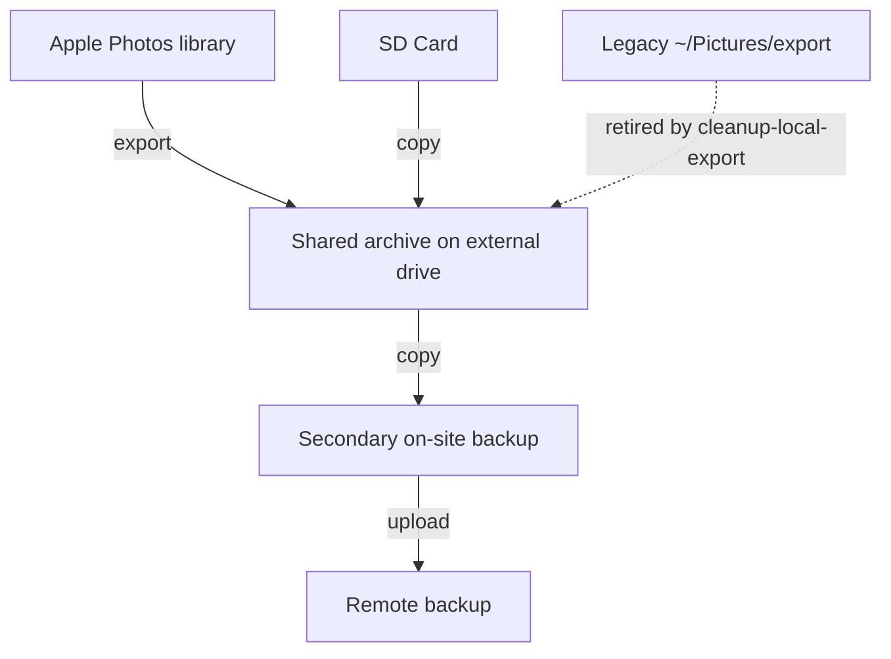

# photos-backup

Opinionated backup solution for Apple Photos on macOS.

## Goals

1. Keep one shared archive of every photo and video in Apple Photos on an
   external drive, writable from more than one Mac.
2. Preserve metadata (EXIF, IPTC, album names) as much as possible.
3. Mirror deletions from the library into the archive, but never without proof.
4. Back up RAW files from an SD card to the same drive.
5. Copy the result to a second on-site drive and to cloud storage.
6. Do all of it incrementally, and stop rather than guess.


```mermaid
flowchart TD
    A[Apple Photos library] --export--> B[Shared archive on external drive]
    E[SD Card] --copy--> B
    B --copy--> C[Secondary on-site backup]
    C --upload--> D[Remote backup]
    F[Legacy ~/Pictures/export] -.retired by cleanup-local-export.-> B
```

The archive is the only authoritative copy. It carries its own osxphotos export
database and run state under `.photos-backup/`, so any Mac that mounts the drive
can continue the same history instead of starting a private one.

## Installation

```bash
cd python/photos_backup
uv sync
uv tool install --editable .   # or: uv pip install -e .
photos-backup --help
```

After dependency changes, refresh the installed tool from this directory with
`uv tool install --force --editable .`. Editable installs pick up source changes
immediately, but do not automatically install new dependencies. For development,
`uv run photos-backup --help` from `python/photos_backup` uses the project's
environment; outside that directory it may find the installed tool on `PATH`.

`photos-backup` is the only entry point; the older `cli` alias was removed, so
reinstall with `uv tool install --force --editable .` to drop it from `PATH`. Configuration is not installed by this repository: it is
stow-managed at `~/.config/osxphotos-backup/photos-backup.toml`.

For tab completion of commands and options in zsh, add this to `~/.zshrc`:

```bash
eval "$(_PHOTOS_BACKUP_COMPLETE=zsh_source photos-backup)"
```

## Everyday workflow

Once configuration is in place, connect the archive drive and run
`photos-backup bootstrap` once to initialize it. After that:

```bash
photos-backup status --short                # compact status and suggested next commands
photos-backup daily                        # export on cadence and reconcile cleanup
photos-backup backup-all --skip-apple-photos # copy SD card, then SSD, then cloud
photos-backup verify --record               # check archive and remember the result locally
```

Run these as separate steps and read each result. If `daily` exits 3 because
cleanup needs approval, its export has still completed; you can continue the
copies while deciding what to delete. For other errors, follow the printed
recovery instructions before continuing. Connect the configured copy drives;
add `--skip-sd-card` when no card is attached. Unconfigured copy steps are skipped.
`daily` prints its export result before reconciling cleanup, so a cleanup error
still leaves the export outcome and report path visible.

When cleanup is pending, preview the run ID printed by `status`:

```bash
photos-backup approve-cleanup RUN_ID --dry-run
photos-backup approve-cleanup RUN_ID           # approve after reviewing the preview
# Or: photos-backup approve-cleanup RUN_ID --discard
```

`backup-all` on its own exports and copies, but does not reconcile archive
cleanup; use `daily` for that. SSD and cloud deletions require separate explicit
flags (`--delete-ssd` and `--delete-remote` on `backup-all`). `verify` checks the
primary archive, not the SSD/cloud copies, and does not checksum file contents.

## Reference guides

- [Configuration and setup](docs/configuration.md): paths, overrides, tool checks, and doctor.
- [Apple Photos exports](docs/exports.md): bootstrap, daily cadence, recent exports, and download retries.
- [Recorded status](docs/status.md): compact output, freshness hints, download failures, and receipts.
- [Archive verification](docs/verification.md): checks, JSON reports, and optional local history.
- [SD-card, SSD, and cloud copies](docs/transfers.md): previews, failures, and deletion flags.
- [Archive safety and cleanup](docs/archive-safety.md): locking, state layout,
  deletion approval, retiring the legacy export, and cross-Mac takeover.
- [Deployment and migration](docs/deployment.md): stow, goback, a new Mac,
  and migrating the old environment configuration.
- [Restore rehearsal](docs/restore.md): recover sample media from SSD and cloud.
- [Development](docs/development.md): tests, dependency compatibility, and profiling.

## Commands

Help groups commands by task using rich-click. In a terminal, backup summaries
and verification results use Rich tables with labeled, colored outcomes.
Redirected summaries and errors stay plain for logs; `status --json`,
`verify --json`, and `doctor --json` still emit JSON. Set `NO_COLOR=1` to disable color, or `TERM=dumb`
for plain summary output even in a terminal.

| Command | Description |
|---------|-------------|
| `photos-backup doctor` | Check configuration, local paths, exclusions, and installed tools without running backups |
| `photos-backup doctor --json` | Print the same versions and checks as one JSON document, with the same exit code |
| `photos-backup --version` | Show the installed application version |
| `photos-backup bootstrap` | Fill a fresh archive with one complete export, then initialize it |
| `photos-backup verify` | Report the health of the shared archive without changing anything |
| `photos-backup verify --record` | Remember the verification result locally for status |
| `photos-backup verify --json` | Print all verification findings as one JSON document |
| `photos-backup status` | Show recorded export dates, writer, pending cleanup, and the next export mode |
| `photos-backup status --short` | Show one line per stage, download failures, and suggested next commands |
| `photos-backup status --check` | Show the compact status and exit 3 when it suggests a command |
| `photos-backup status --json` | Read archive status and local transfer receipts as one JSON document |
| `photos-backup recent` | Back up photos/videos taken in the last N days, with live progress |
| `photos-backup daily` | Export from Apple Photos into the shared archive on cadence |
| `photos-backup approve-cleanup RUN_ID` | Delete the archive files a pending cleanup run listed, after revalidating them |
| `photos-backup approve-cleanup RUN_ID --dry-run` | Revalidate pending cleanup and list proposed deletions and files to keep |
| `photos-backup approve-cleanup RUN_ID --discard` | Reject a pending cleanup run instead; nothing is deleted |
| `photos-backup cleanup-local-export` | Delete the legacy local export once the archive proves it is redundant |
| `photos-backup apple-photos` | Export manually, forwarding extra flags to osxphotos |
| `photos-backup sd-card` | Copy RAW files from SD card to primary backup |
| `photos-backup ssd` | Copy primary backup to secondary on-site backup (SSD); deletes only with `--delete` |
| `photos-backup remote` | Copy backup to cloud via rclone; preserve remote-only files |
| `photos-backup remote --delete` | Mirror backup to cloud, including deletions |
| `photos-backup backup-all` | Run the Apple Photos, SD card, SSD, and remote steps in one pass |

### Exit codes

| Code | Meaning | Examples |
|------|---------|----------|
| 0 | The run did what it was asked, including doing nothing | a clean export, a refused confirmation, a dry run |
| 1 | The run failed | osxphotos reported errors, a verification check failed, a pipeline step raised |
| 2 | The command line or configuration is wrong | unknown option, missing or invalid TOML |
| 3 | A person has to act before this can succeed | archive not initialized, cleanup awaiting approval, a blocked takeover, an unmounted drive, an archive locked by another run |

Exit 3 is deliberately not a failure: it means the tool stopped on purpose and a
person, not a retry, resolves it. Scheduled runs should treat 3 as "notify me"
rather than "page me". `--notify` on `daily`, `backup-all`, `verify`, `sd-card`,
`ssd`, `remote`, and `status --check` posts a macOS notification when a run fails, needs you, or is stopped (Ctrl-C, `kill`,
launchd), and stay silent on success. Mistyped options exit 2 before the command
starts, so run a new schedule once by hand. `photos-backup daily` still exports before reporting
a pending cleanup, so backups never stop over a deletion question.

## Configuration

Copy [photos-backup.example.toml](photos-backup.example.toml) to
`~/.config/osxphotos-backup/photos-backup.toml` and edit the paths. Configure only
what you use: Apple Photos, SD card, SSD, and rclone each have their own section.
Paths support `~` and environment variables. Run `photos-backup doctor` to check
configuration, local paths, and installed tools before backing up.

Use `photos-backup --config PATH COMMAND` for another configuration, or
`photos-backup --volume PATH COMMAND` to redirect the Apple Photos archive for
one run. The volume override does not change SSD or remote copy sources.
See [configuration and setup](docs/configuration.md) for the full behavior.

## Common recovery steps

- **Archive not initialized:** run `photos-backup bootstrap`. Rerun it after an
  interruption; completed exports are retained. Use `recent` to prioritize recent
  photos while bootstrap is unfinished.
- **Incomplete downloads:** run `photos-backup status` to see sample filenames,
  grouped reasons, and the retry command. Increase `--download-timeout` when
  needed. `recent --days N` selects capture dates; older imports may need a larger
  window or a full export.
- **Copy needs updating or failed:** `status` and `status --short` show suggested commands.
  Mirror retries include `--dry-run`; review the preview before enabling deletions.
- **Drive disconnected or archive busy:** reconnect it or wait for the active
  operation to finish, then rerun. `status` still shows local copy and verification
  receipts when archive access fails.
- **Cleanup pending:** preview with `approve-cleanup RUN_ID --dry-run`, then
  approve or discard it. A cleanup decision does not prevent making backup copies.
- **Want to check your backups:** `verify --record` checks the primary archive
  and remembers the result on this Mac. It checks sizes and timestamps, not file
  contents or secondary copies. Follow the [restore rehearsal](docs/restore.md)
  to try recovering actual files from SSD and cloud.

Status describes recorded activity, not proof that every destination is current.
`status --json` provides the detailed data for scripts; `status --short` is a
compact text view. Ordinary `verify` remains read-only unless you request a report
or local receipt.
