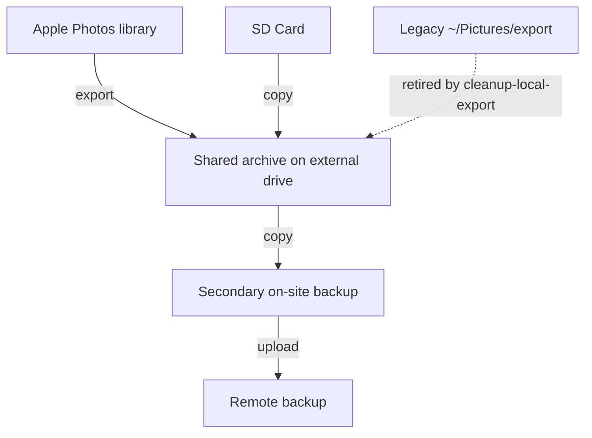

# photos-backup

Opinionated backup solution for Apple Photos on macOS.

## Goals

1. Keep one shared archive of every photo and video in Apple Photos on an
   external drive, writable from more than one Mac.
2. Preserve metadata (EXIF, IPTC, album names) as much as possible.
3. Mirror deletions from the library into the archive, but never without proof.
4. Back up RAW files from an SD card to the same drive.
5. Copy the result to a second on-site drive and to cloud storage.
6. Do all of it incrementally, and stop rather than guess.


```mermaid
flowchart TD
    A[Apple Photos library] --export--> B[Shared archive on external drive]
    E[SD Card] --copy--> B
    B --copy--> C[Secondary on-site backup]
    C --upload--> D[Remote backup]
    F[Legacy ~/Pictures/export] -.retired by cleanup-local-export.-> B
```

The archive is the only authoritative copy. It carries its own osxphotos export
database and run state under `.photos-backup/`, so any Mac that mounts the drive
can continue the same history instead of starting a private one.

## Installation

```bash
cd python/photos_backup
uv sync
uv tool install --editable .   # or: uv pip install -e .
photos-backup --help
```

`photos-backup` is the entry point; `cli` remains as an alias for it and exposes
the same commands. Configuration is not installed by this repository: it is
stow-managed at `~/.config/osxphotos-backup/photos-backup.toml`.

## Everyday workflow

Once configuration is in place, connect the archive drive and run
`photos-backup bootstrap` once to initialize it. After that:

```bash
photos-backup status                        # recorded dates and the next export mode
photos-backup daily                         # export on cadence and reconcile cleanup
photos-backup backup-all --skip-apple-photos # copy SD card, then SSD, then cloud
photos-backup verify                        # check archive records, sizes, and timestamps
```

Run these as separate steps and read each result. If `daily` exits 3 because
cleanup needs approval, its export has still completed; you can continue the
copies while deciding what to delete. For other errors, follow the printed
recovery instructions before continuing. Connect the configured copy drives;
add `--skip-sd-card` when no card is attached. Unconfigured copy steps are skipped.
`daily` prints its export result before reconciling cleanup, so a cleanup error
still leaves the export outcome and report path visible.

When cleanup is pending, preview the run ID printed by `status`:

```bash
photos-backup approve-cleanup RUN_ID --dry-run
photos-backup approve-cleanup RUN_ID           # approve after reviewing the preview
# Or: photos-backup approve-cleanup RUN_ID --discard
```

`backup-all` on its own exports and copies, but does not reconcile archive
cleanup; use `daily` for that. SSD and cloud deletions require separate explicit
flags (`--delete` and `--delete-remote` on `backup-all`). `verify` checks the
primary archive, not the SSD/cloud copies, and does not checksum file contents.

## Reference guides

- [Archive safety and cleanup](docs/archive-safety.md): locking, state layout,
  deletion approval, retiring the legacy export, and cross-Mac takeover.
- [Deployment and migration](docs/deployment.md): stow, goback, a new Mac,
  and migrating the old environment configuration.
- [Restore rehearsal](docs/restore.md): recover sample media from SSD and cloud.
- [Development](docs/development.md): tests, dependency compatibility, and profiling.

## Commands

| Command | Description |
|---------|-------------|
| `photos-backup doctor` | Check configuration, local paths, exclusions, and installed tools without running backups |
| `photos-backup --version` | Show the installed application version |
| `photos-backup bootstrap` | Fill a fresh archive with one complete export, then initialize it |
| `photos-backup verify` | Report the health of the shared archive without changing anything |
| `photos-backup verify --json` | Print all verification findings as one JSON document |
| `photos-backup status` | Show recorded export dates, writer, pending cleanup, and the next export mode |
| `photos-backup status --json` | Read archive status and local transfer receipts as one JSON document |
| `photos-backup recent` | Back up photos/videos taken in the last N days, with live progress |
| `photos-backup daily` | Export from Apple Photos into the shared archive on cadence |
| `photos-backup approve-cleanup RUN_ID` | Delete the archive files a pending cleanup run listed, after revalidating them |
| `photos-backup approve-cleanup RUN_ID --dry-run` | Revalidate pending cleanup and list proposed deletions and files to keep |
| `photos-backup approve-cleanup RUN_ID --discard` | Reject a pending cleanup run instead; nothing is deleted |
| `photos-backup cleanup-local-export` | Delete the legacy local export once the archive proves it is redundant |
| `photos-backup apple-photos` | Export manually, forwarding extra flags to osxphotos |
| `photos-backup sd-card` | Copy RAW files from SD card to primary backup |
| `photos-backup ssd` | Sync primary backup to secondary on-site backup (SSD) |
| `photos-backup remote` | Copy backup to cloud via rclone; preserve remote-only files |
| `photos-backup remote --delete` | Mirror backup to cloud, including deletions |
| `photos-backup backup-all` | Run the Apple Photos, SD card, SSD, and remote steps in one pass |

### Exit codes

| Code | Meaning | Examples |
|------|---------|----------|
| 0 | The run did what it was asked, including doing nothing | a clean export, a refused confirmation, a dry run |
| 1 | The run failed | osxphotos reported errors, a verification check failed, a pipeline step raised |
| 2 | The command line or configuration is wrong | unknown option, missing or invalid TOML |
| 3 | A person has to act before this can succeed | archive not initialized, cleanup awaiting approval, a blocked takeover, an unmounted drive |

Exit 3 is deliberately not a failure: it means the tool stopped on purpose and a
person, not a retry, resolves it. Scheduled runs should treat 3 as "notify me"
rather than "page me", and `photos-backup daily` still exports before reporting
a pending cleanup, so backups never stop over a deletion question.

## Configuration

Settings live in `~/.config/osxphotos-backup/photos-backup.toml`. Pass
`--config PATH` before a command to use another file. Copy
`photos-backup.example.toml` as a starting point; it holds no secrets and none
should be added to it.

Pass `--volume PATH` before a command to send one run somewhere else without
editing the file, for instance when the usual drive is not connected:

```bash
photos-backup --volume /Volumes/T7 apple-photos --use-photokit
photos-backup --volume ~/Pictures/archive daily
```

The archive's sub-path under the configured volume is preserved, so a
`volume` of `/Volumes/SanDisk` and an `archive` of
`/Volumes/SanDisk/Media/Apple Photos` become `/Volumes/T7/Media/Apple Photos`.
The configuration file is still validated as usual. Only the Apple Photos
workflow is re-pointed: under `backup-all`, the `[ssd]` and `[rclone]` steps
keep reading their own configured sources.

Each section maps to one workflow and is loaded only by the commands that need
it: `[apple_photos]`, `[sd_card]`, `[ssd]`, and `[rclone]`. Paths accept `~` and
environment variables and must be absolute once expanded. Invalid values (wrong
type, out-of-range cadence or cleanup limit, an archive outside its volume, an
unknown key) fail with an error naming the file, section, and key.

Only the sections a command needs are read, so an Apple Photos export works on a
machine that has no SD card, SSD, or rclone configuration. `backup-all` and `ssd`
report a workflow whose section is absent as skipped instead of failing.
Pipeline summaries distinguish `Skipped by request` from
`Not configured: [section]`. Apple Photos is the exception: `backup-all` requires
`[apple_photos]` unless you pass `--skip-apple-photos` for a copy-only run.
Before `backup-all` starts any export or transfer, it validates every enabled
section and any configuration it depends on. Invalid configuration exits 2
immediately. Skipped sections are not loaded unless another enabled step needs
them (for example, remote backup's default source uses `ssd.destination`).
After configuration validation, `backup-all` checks all required executables
before starting any step: ExifTool for a real Apple Photos export, rsync for
enabled SD-card/SSD copies, and rclone for an enabled remote copy. Missing tools
are listed together and exit 1. Skipped or unconfigured steps require no tools.
A dry run still needs rsync/rclone for transfer previews, but its planning-only
Apple Photos step needs no ExifTool executable.

After preflight, `backup-all` prints the enabled source → destination pairs and
whether each step can delete destination files. Local copies show the actual
target including the source directory name. This overview makes `--volume`
overrides visible alongside the independently configured SSD and remote sources.

SSD and SD-card copies check configured sources before creating the destination.
A missing source requires attention (exit 3), including a configured SD-card
backup directory. For copy source and destination paths under `/Volumes/<drive>`, the
drive must be mounted, even during previews; an absent mount is never created.
Remote uploads apply the same mount and source-directory checks before starting
rclone. Ordinary local paths remain supported without adding configuration keys.

SD-card and SSD copies also reject overlapping source and destination paths,
including symlink aliases, before creating directories or starting rsync. Each
source is copied into `destination/source-name`; SSD inputs must map to distinct,
non-overlapping directories. An omitted `exclude_file` is optional. An explicitly
configured file that is missing or is not a regular file prints a warning to
stderr, and ordinary copying continues without those exclusions, including in dry
runs. With SSD deletions enabled (`ssd --delete` or `backup-all --delete`), every
configured SSD and SD-card exclusion file must exist and be a regular file.
Otherwise the SSD step exits 3 before creating its destination or starting either
copy. The same refusal applies to previews. Restore the exclusion file or rerun
without `--delete`; omitting an exclusion file from configuration remains supported.

When an SSD or remote source is the managed archive or a directory within it, the copy
holds the archive's read lock for the transfer. A running export or cleanup
blocks the copy with exit 3 before any destination is created; a copy already
in progress blocks new archive writers. Previews take the same read lock and
create nothing. An archive with missing or invalid lock metadata is refused.
Ordinary directory copies need no Apple Photos configuration. Configure
`ssd.source` or `rclone.source` as the archive itself: copying a parent directory
does not discover and lock archives nested inside it.

Transfer output adapts to stdout: terminals keep live progress; redirected output
keeps rsync statistics and rclone's one-line statistics at one-minute intervals,
plus errors and the final summary. SSD logs omit the verbose per-file listing;
rsync dry runs retain itemized proposed changes even when redirected.
The rclone log mode explicitly enables statistics at `NOTICE` level so they remain
visible without `--progress` ([rclone logging options](https://rclone.org/docs/#stats-log-level-string)).

Local export, SD-card, and SSD workflows print available destination filesystem
space after their path checks, including previews. For a destination not yet
created, this uses the nearest existing ancestor. This is informational: the tool
does not estimate incremental backup size or promise that the run will fit. If
space cannot be read, it prints that fact and continues. No remote capacity query
is performed.

### Checking setup

`photos-backup doctor` collects configuration, local path, archive-access, and
exclusion-file problems in one pass. It reports Python, application, and dependency
versions, plus paths and versions of tools needed by configured workflows. Version
queries have a five-second timeout. It creates no directories, receipts, or archive
state, does not load the Photos library, and does not contact cloud storage.
A missing optional section is skipped; an uninitialized archive is identified with
a bootstrap hint. This is setup diagnosis, not file verification or a guarantee
that a subsequent backup will succeed. Exit codes are 2 for configuration errors,
1 for tool/I/O failures, and 3 for paths or exclusions requiring attention, in that
priority order; otherwise 0. Configured but disconnected SD cards are reported.

### Bootstrapping an archive

`photos-backup bootstrap` builds the archive from the Photos library alone;
nothing is imported from `apple_photos.legacy_export`, so a partial local export
never becomes the baseline. It claims the archive for this Mac using the same
takeover check as `daily`, runs one full export, and initializes the archive only
when that export exits cleanly, downloads every asset from iCloud, and leaves an
export-database record for every asset in the library. Anything short of that
prints the reason and exits 1 without writing `initialized_at`.

Because initialization is the last step, an interrupted bootstrap is resumed by
running the command again: the second run sees the export database it left
behind, runs another full export, and picks up where the first stopped.
Bootstrap accepts only an empty archive or one it left incomplete itself. An
archive that holds other content but no `.photos-backup` metadata is refused
with exit 3, naming what it found, rather than exporting into someone else's
directory.

A `bootstrap --dry-run` validates the archive and prints the full export plan,
but does not invoke osxphotos or scan the Photos library for coverage. Coverage
is checked after the real export. It writes nothing and never initializes.

### Checking recorded status

`photos-backup status` shows the archive writer, initialization and export
timestamps, last successful baseline report, last archive cleanup reconciliation, pending
cleanup, and the next export mode with its cadence reason. Timestamps include relative ages; pending
cleanup includes commands to approve or discard it. It reads state without
scanning exported files, opening the Photos library, taking over ownership, or
writing anything.
Cleanup reconciliation is separate from SSD and cloud copying; its timestamp
does not indicate when either secondary backup last succeeded. The secondary
transfer history below it records those copies separately.
An uninitialized archive suggests `photos-backup bootstrap`.
The baseline report belongs to the last successful full or incremental export;
it does not describe newer failed, recent, or custom manual exports.

Status also shows the latest Apple Photos export attempt: mode, outcome, times,
Mac, report path (if the exporter wrote it), error, and whether it advanced the
baseline. This receipt travels with the archive and includes failed, interrupted,
recent, and custom exports without changing cadence or cleanup decisions.
New receipts also record missing-file and export-error counts when a usable
export report exists. A failed or interrupted attempt shows the download report
path (if written) and a copyable retry command when the original options are
known. Recent retries retain `--days` and the download timeout; their rolling
date window is recalculated when rerun. Pipeline export retries skip the SD-card,
SSD, and remote steps. Custom/limited manual exports ask you to reuse the original
options instead of guessing. Older receipts remain readable without these fields.
It describes the export step, not subsequent bootstrap coverage or cleanup.
Attempts start when the exporter is invoked; earlier configuration, mount, and
takeover refusals do not replace the receipt. A process killed before it records
completion leaves an explicit "completion not recorded (running or interrupted)"
status. Dry runs never update it, and existing archives show "not recorded" until
their next real export. Receipt write failures warn without masking export results;
an unreadable receipt is reported without repairing it or hiding baseline state.

Status retains the last successful export time across subsequent failed or
interrupted exports, including successful recent and custom runs. Older receipts
fall back to the success they still record and the baseline; lost history cannot
be reconstructed. Direct archive copies get a recorded-time freshness hint.
Cloud routes also show when a currently configured SSD copy into their source
completed after the last successful upload started. Matching is lexical and never
probes disconnected copy drives; symlink aliases are not inferred. These hints do
not verify destination contents. Failed/interrupted current transfer routes show
copyable retry commands; mirrors suggest `--delete --dry-run` first. An SSD retry
runs its configured SSD routes together. Historical routes have no retry hint.

Transfer history records the mode of both the latest attempt and the last
successful copy: `copy` preserves destination-only files, while `mirror` enables
deletions subject to the transfer's exclusions. A failed mirror therefore does
not relabel an earlier successful copy. Older receipts remain readable and show
"mode not recorded"; the current configuration is never used to guess their mode.

Suggested recovery and cleanup commands preserve any explicit `--config` and
`--volume` options and quote paths for pasting into a shell, so they target the
same archive as the command that printed them.

Status exits 0 when state can be read, even if bootstrap or cleanup is pending;
it is an informational view, not a health check. Use `verify` to check the files.
When the archive is unavailable, locked, or its state cannot be read, status still
shows local transfer history alongside an archive error. It preserves the archive
error's nonzero exit code; it does not infer archive state from transfer receipts.
When `[apple_photos]` is absent, status shows that archive status is not configured,
prints local transfer history, and exits 0. The configuration file must still exist
and contain valid TOML. Status validates all configured workflow sections and
remote-source dependencies; invalid configuration exits 2.

`status --json` prints one versioned JSON document with `archive`, `archive_configured`, `observed_at`,
`files_verified` (always false), `state`, `next_export`, `archive_error`, `transfers`, and
`transfer_history_errors`. Dates are ISO 8601 strings with timezones; missing
state values are null. It preserves the normal status exit codes, including exit
0 for pending cleanup or an uninitialized archive. Errors reading local receipts
are included in `transfer_history_errors` rather than mixed into JSON output.
The additive `last_export_attempt` and `export_attempt_error` fields contain the
latest export receipt and any read error, respectively, or null when unavailable.
Transfer attempts expose `mode` when recorded; older attempts may omit it.
If the archive cannot be read, `state` and `next_export` are null and
`archive_error` contains the reason; otherwise `archive_error` is null. The JSON
is still printed on archive errors, with CLI diagnostics on stderr.
For copy-only configurations, `archive_configured` is false and `archive`, `state`,
`next_export`, and `archive_error` are null.
The additive `configured_transfers` field lists every current transfer route,
including routes with no receipt (`last_attempt` and `last_success` are null).
`historical_transfers` contains receipts whose step, source, or destination no
longer matches the configuration. `transfers` still contains all recorded receipts.
Each configured route also has `archive_exported_since_copy`: true when a known
successful archive export is newer than the last successful copy's start, false
when the compared export is no newer, or null when comparison is unavailable.
This uses the baseline export timestamp and, when successful, the latest export
attempt's completion (including recent/custom exports). Only an exact configured
archive source is compared; parent directories, descendants, symlink aliases,
and indirect SSD-to-cloud routes are not inferred. The text view highlights true
values. This is a recorded-time hint, not destination verification or a guarantee
that a false value means everything is current. Status still performs no file scan.

### Transfer history

The text view starts with an attention summary when latest attempts failed or were
interrupted, completion was not recorded, or a copy has never succeeded. An attempt
without a recorded completion may still be running. These informational counts can
overlap and do not change the status exit code. Attention counts cover current
configured routes only, including those with no successful copy recorded.

Real `sd-card`, `ssd`, `remote`, and `backup-all` copies record local receipts under
`~/.local/state/photos-backup/transfers/` (or
`$XDG_STATE_HOME/photos-backup/transfers/` when that variable is an absolute path).
Each named configuration file has separate history, with one receipt per step,
source, and destination. SSD and SD-card destinations include the source directory
name. SD-card receipts identify the configured source path, not a physical card.
Status shows the last attempt and last successful copy with relative ages, plus
available file count, size, and duration from the successful copy for each route;
routes with no receipt explicitly say no successful copy is recorded. When
configuration changes, older routes appear separately under historical destinations.
Matching uses the configured paths without probing copy drives, so an unmounted
destination still appears. `--volume` continues to affect only Apple Photos.

A failed or interrupted transfer does not erase the previous success. An attempt
whose completion was never recorded is labeled as running or interrupted, never
successful. Receipts retain counts, size, duration, and any transfer error. Skipped
steps and dry runs do not update history. SSD path, lock, exclusion, and destination
preparation failures record a failed preflight attempt for each configured SSD
route while preserving its previous success. Pipeline configuration and executable
checks still run before any workflow is attempted. History begins when receipts
are enabled for each workflow;
older transfers and transfers from another Mac cannot be inferred.

Receipts are replaced atomically under a local lock. History write failures warn
without changing the transfer's result. Reading status reports malformed receipts
without modifying them. On the next real transfer, an invalid receipt is preserved
under a unique `.corrupt-…` filename beside the original, and a fresh receipt starts
with no previous success. If preservation fails, the invalid receipt stays in place
and recording warns without changing the transfer result. Reading status creates
nothing. These records describe completed commands,
not verification of the destination files, and never modify archive writer state.

### Verifying an archive

`photos-backup verify` reads the archive and reports one `PASS`/`FAIL` line per
property with the evidence behind it. It exits 0 when all checks pass, 3 when
pending cleanup approval is the only failed check, and 1 when any other check
fails. It writes nothing at all: no directory, no state, no lock file.

If the archive cannot be opened, `verify --json` still prints one JSON document:
`passed` is false, `checks` is empty, and `archive_error` contains the reason.
The diagnostic remains on stderr and the original nonzero exit code is preserved.
When verification runs, `archive_error` is null. Configuration and command-line
errors retain normal CLI diagnostics. `--report` saves completed verification
findings only; an archive-open error does not create a report file.

Verification prints its current phase and file-check count to stderr, with
periodic updates during long scans. Progress counts inspected records, including
missing or invalid files; the final findings determine whether verification
passed. JSON reports retain their existing fields and add timing information.

| Check | Fails when |
|-------|------------|
| `export database` | It is missing or unreadable, `PRAGMA integrity_check` is not `ok`, the schema version is one this osxphotos cannot read, or records point outside the archive |
| `signatures` | An exported file no longer matches its recorded size and modification time |
| `missing assets` | An exported file is missing, unreadable, not a regular file, or reached through a symlink beneath the archive |
| `state` | State is unreadable, the archive was never initialized, no export is recorded, the last full export is newer than the last successful one, or the last report is gone |
| `ownership` | No Mac has claimed the archive |
| `pending cleanup` | A cleanup run is still waiting for approval |

Every read that can fail is caught and reported as a failed check, so one corrupt
file never hides the state of everything else. Another Mac owning the archive is
a pass that names both hostnames, since that is normal for a shared archive.

Signature output counts matched files, changed files, records missing a size or
modification time, and signed records unavailable for comparison. A missing
signature is reported as incomplete coverage, not a mismatch; the signatures
check can still pass for the records it could compare. Missing or unreadable
files fail the separate `missing assets` check. Verification checks size and
modification time only; it does not checksum file contents.

To save the full findings, including every missing, changed, or out-of-archive
file path rather than just the terminal's three-path sample:

```sh
photos-backup verify --report ~/Desktop/photos-verification.json
```

The JSON contains `version`, `archive`, `passed`, `archive_error`, and a `checks`
array, plus UTC `started_at` and `completed_at` timestamps and `elapsed_seconds`
measured with a monotonic clock. Timing covers archive opening and verification,
not report writing; archive-open errors also include timing in `--json` output.
Each check has `name`, `passed`, `detail`, and `paths`. The report is saved even
when verification fails, and verification keeps its usual exit code. Choose a new file outside the
archive in an existing directory: invalid parent directories are rejected before
the scan starts. Reports never overwrite existing files or modify archive contents.
A report write failure exits 1.

Use `photos-backup verify --json` to print the same document directly to stdout,
including failed findings, with the same exit codes. Progress and diagnostics stay
on stderr. It can be combined with `--report` to save an identical document while
also printing JSON; the saved-report notice then goes to stderr. Configuration or
argument errors produce CLI diagnostics without a JSON document; archive-opening
errors produce the error document described above.

### Daily export

`photos-backup daily` exports Apple Photos straight into the archive; nothing is
staged anywhere else. It exits 3 and does nothing when the archive has not been
initialized, 1 when the export reported errors, and 0 otherwise.

Every run uses the same osxphotos arguments so two machines produce the same
layout: `--update --update-errors` with `--download-missing --use-photokit` and
`--retry 3`, `--exiftool`, `--export-aae`, `--sidecar json`, originals, edited
versions, Live Photos, RAW files and bursts all kept, `--directory
'{created.year}/{created.mm}'`, `--filename
'{created.strftime,%Y-%m-%d-%H%M%S}_{original_name}'`, `--album-keyword` so
album names travel as metadata instead of directories, `--exportdb` pointing at
`.photos-backup/export.db`, and `--report` pointing at the per-host report.
`--cleanup` is never passed here.

The cadence comes from durable state and the clock:

| Situation | Run |
|-----------|-----|
| No full export has completed | full |
| No full export since the configured weekday (default Monday) | full |
| The last full export is at least `full_export_max_age_days` old | full |
| Otherwise | incremental from `last_successful_export_at` minus `incremental_overlap_days` |

A run advances `last_successful_export_at` (and `last_full_export_at` for a full
run) only when osxphotos exits 0 and its report contains no error or missing
rows. An incomplete export exits 1 and keeps completed files and reports. The
next run retries from the previous successful baseline.

The report is the evidence that the export ran: a report osxphotos never wrote,
one that cannot be read, and one carrying none of the columns osxphotos writes
are all failed exports, so neither the state nor the mirror moves on an export
nothing describes. A report holding only its header is a valid clean run that
exported nothing. Every invocation is given report paths nothing has written
yet, so the evidence always belongs to the run being judged: a second export on
the same host and day that writes no report fails instead of inheriting the
first export's report.

The supplementary late-additions CSV is best-effort: a file, encoding, or CSV
error prints a warning identifying the report, which may be partial. A clean,
complete export still advances its baseline; errors in the main osxphotos report
continue to prevent that advance.

Apple Photos dry runs (`bootstrap`, `daily`, `recent`, `apple-photos`, and the
Apple Photos step of `backup-all`) are planning-only:
they do not invoke osxphotos, write reports, or touch `export.db` or `state.json`.
The manual `apple-photos --testing` command is the deliberate exception: it runs
a limited osxphotos simulation for exporter development without writing assets.
Adding `--dry-run` to `--testing` selects the planning-only preview instead.

Every export entry point checks the archive writer before exporting, including
manual `apple-photos` and `backup-all` runs. Manual extra flags cannot override
the managed library, destination, export database, report, dry-run mode, or
cleanup behavior, nor load an osxphotos configuration that overrides them.
Use this tool's TOML configuration, `--volume`, and cleanup commands for those
changes. Other extra flags still accept `--flag value` or `--flag=value`.
Manual exports with any forwarded flags keep their exported files and reports
but do not advance daily/full backup timestamps or replace the baseline report.
This conservative rule covers asset filters, limits, and skipped components
without assuming a custom run covered the scheduled export. Manual exports
without forwarded flags retain the normal cadence behavior.
Real exports print their CSV report path, including when the export fails.

SSD, SD-card, and remote transfers display progress while they run. Failure
summaries include a short diagnostic excerpt from the retained output tail,
preferring explicit error lines when available. Full streamed output remains
available in the terminal or redirected log. Their
`--dry-run` options invoke rsync/rclone in preview mode and create no destination
directories. Paths and exclude files may contain spaces or quotes. A failed
standalone `remote` command exits 1. Transfer preview summaries say `DRY RUN`
and label counts as proposed transfers; Apple Photos uses `PLANNED` because
its exporter is not invoked. A successful pipeline preview ends with
`PREVIEW COMPLETE`. `backup-all` exits 3 for action-required steps, such as a
blocked Apple Photos takeover or unavailable SSD source, unless another step
fails, in which case it exits 1.
If every pipeline step is skipped, the summary says
`NOTHING TO DO — all steps skipped` and exits 0, including in dry runs.

The Apple Photos step of `backup-all` shows the same live export phases and
per-asset download budget as `daily`. Use `backup-all --download-timeout 300`
to allow five minutes per missing asset across retries; this does not limit the
whole pipeline. Skipping Apple Photos also skips its progress display, and
`--dry-run` remains planning-only for that step.

SSD summaries retain each completed copy if a later copy fails, in both `ssd`
and `backup-all`. The failed copy is named, and any remaining SSD copy is
reported as skipped because the previous copy did not complete. SSD source
and destination checks still run before any copying starts.

If an SSD step fails or requires action, `backup-all` skips remote backup when
its source overlaps the SSD destination (including symlink aliases, subdirectories,
and parent directories). An independent remote source can still run. Explicitly
using `--skip-ssd` allows uploading the existing SSD backup. These rules also
apply to dry runs; the SSD error still determines the pipeline exit code.

Transfer summaries explicitly show zero files or zero proposed transfers when
reported by the transfer tool. If statistics are unavailable, the summary says
so instead of implying that no files needed copying.

### Back up recent photos without waiting for bootstrap

```sh
photos-backup recent                         # photos/videos taken in the last 30 days
photos-backup recent --days 60               # a larger capture-date window
photos-backup recent --days 30 --dry-run      # show the plan without exporting
photos-backup recent --download-timeout 300  # allow 5 minutes per missing asset
```

`recent` uses the existing archive and export database, including an interrupted
bootstrap, and applies the normal writer check. It processes fully local assets
first and then attempts missing originals and other requested components through
PhotoKit. Unchanged exported files are skipped by osxphotos's update checks.
The date filter uses capture dates, not import dates; newly imported older photos
are outside the selected window.

There is **no total run time limit**. Missing-file retrieval has a 120-second
budget per asset, shared across its original/edited versions and any retries
within a run. Local copies and metadata writes do not consume that budget.
One download worker is started lazily and reused for serial retrievals, avoiding
repeated Python/PhotoKit imports. Worker startup and request overhead count toward
the asset's budget. A stalled worker is killed and reaped without interrupting an
archive write; the next eligible asset gets a fresh worker. Ctrl+C also reaps the
worker. This is an elapsed-time
limit, so a large download taking longer than the budget is also deferred; use
`--download-timeout` to allow it more time. Bootstrap and daily exports offer
the same timeout option and live phase/download progress:

```sh
photos-backup bootstrap --download-timeout 300
photos-backup daily --download-timeout 300
```

Both default to 120 seconds per asset and report total command time, including
failed or interrupted runs. Bootstrap also reports its library coverage check;
daily reports cleanup reconciliation. Their dry runs remain planning-only.

Failed or timed-out downloads are printed immediately. Failures still unresolved
at the end of the run are recorded beside the CSV export report in a `.downloads.json` file, with asset UUIDs, filenames, and
reasons. Other unavailable components appear in the CSV's `missing` rows.
The recent command exits nonzero when files remain missing or errors occur.
Rerun it to retry; completed exports are retained, and each run gets a fresh
per-asset budget. Items that age out of the date window require a larger `--days`
value or a full export.

`recent` announces archive checks, library loading, asset selection, export, and
report generation. During export, status shows the current filename, **assets
processed / selected**, operation elapsed time, and unresolved download count.
Retrieval status also shows the attempt number and remaining per-asset budget.
Processed assets include skipped and unsuccessful items; one asset can produce
multiple files. Final file outcomes come from the export CSV, not that counter.
No byte percentage or estimated completion time is inferred from a PhotoKit wait.

Terminal status refreshes every second. Redirected output uses plain lines every
10 seconds, plus phase transitions and failures. Phase timings include nested
work and must not be added together. Export elapsed time includes report
creation; total command time also includes archive checks and library loading.

Late-additions reports reuse Spotlight metadata for repeated paths within a run.
Each `mdls` call has a 10-second timeout. Unavailable metadata remains blank and
produces an enrichment warning; it does not turn an otherwise successful media
backup into a failed export.

A recent export never initializes the archive, advances its full/daily export
timestamps, or mirrors deletions. Finish bootstrap separately when a complete
library backup is wanted. Stop an existing bootstrap with Ctrl+C and wait for
it to exit before starting `recent`; both use the same archive lock.

## Finding late shared photos

Apple Photos exports are organized by the photo's content creation date, so a
photo taken in March or April can appear in an older month directory even when
it is first synchronized in June. Each export writes an additional
`late_photo_additions_<host>_YYYY-MM-DD.csv` report next to the
`photos_export_<host>_YYYY-MM-DD.csv` report in `.photos-backup/reports/`. Both
names gain a `_2`, `_3`, ... suffix for every further export the same host runs
on the same day, so an export never reads a report an earlier run left behind
and no earlier report is overwritten. It lists files that were `new` or
`updated` during the run, their Spotlight/Finder dates, device make/model, and
whether the file matches configured spouse-device models.

Configure spouse-device models in the `[apple_photos]` section:

```toml
spouse_device_models = ["iPhone SE (2nd generation)", "iPhone 17"]
```

For an immediate Finder-compatible search, use Spotlight metadata directly.
Replace the example path with your configured `apple_photos.archive`:

```sh
mdfind -onlyin "/Volumes/SanDisk/Media/Apple Photos" \
'kMDItemDateAdded >= $time.iso(2026-06-01T00:00:00Z) &&
 kMDItemContentCreationDate < $time.iso(2026-06-01T00:00:00Z) &&
 kMDItemAcquisitionModel == "*iPhone SE*"'
```

The same fields can be used in a Finder Smart Folder scoped to the export
directory: `Date Added`, `Content created`, and, when Finder exposes it,
`Device model`. Use the generated CSV when Finder cannot show `Device model` as
a list column.

## Remote backup (rclone)

The `remote` command copies your backup to a cloud storage provider using
[rclone](https://rclone.org/).

**Behavior change:** remote backup now uses `rclone copy` by default, preserving
files that exist only at the destination. To retain the previous deletion-mirroring
behavior, use `photos-backup remote --delete` (which uses `rclone sync`). Review
the effect first with `photos-backup remote --delete --dry-run`.

For the full pipeline, `backup-all --delete` continues to enable SSD deletions
only. Use `backup-all --delete-remote` to enable cloud deletions, or pass both
flags to mirror deletions at both destinations. Neither flag changes Apple Photos
archive cleanup approval rules. Update any scripts that relied on automatic remote
deletions to pass the appropriate flag.

1. Install rclone: `brew install rclone` or see https://rclone.org/install/
2. Configure a remote: `rclone config`
3. Set `remote` in the `[rclone]` section (e.g. `b2:my-photos-bucket`)
4. Optionally set `source` (defaults to `ssd.destination`)
